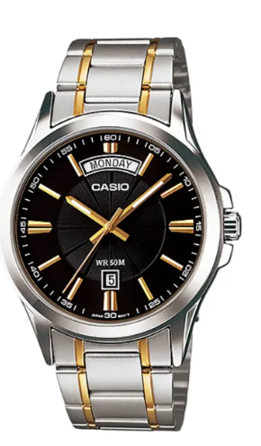

# ⌚ Aeterna Watches — Premium Men's Timepieces

A luxury men's watch brand website with AI-powered concierge, real watch photos, and stunning animations.



## 🚀 Live Demo

- **Frontend**: [Deploy on Vercel](https://vercel.com/asad-projects1)
- **Backend**: [Deploy on Render/Railway]
- **GitHub**: [github.com/asadh-74](https://github.com/asadh-74)

---

## 📁 Project Structure

```
aeterna-watches/
├── frontend/              # Static site (deploy to Vercel)
│   ├── index.html
│   ├── style.css
│   ├── script.js
│   ├── images/            # 8 real watch photos
│   └── vercel.json        # Vercel deployment config
├── backend/               # Node.js API (deploy separately)
│   ├── server.js
│   ├── package.json
│   └── .env.example
└── README.md
```

---

## 🛠 Local Development

### 1. Backend
```bash
cd backend
npm install
cp .env.example .env
# Add your API keys to .env
npm run dev
```
Backend runs at `http://localhost:3001`

### 2. Frontend
```bash
cd frontend
npx serve .    # or python -m http.server 3000
```
Frontend runs at `http://localhost:3000`

---

## 🌐 Deployment Guide

### Frontend → Vercel

1. Push this repo to GitHub:
```bash
git init
git add .
git commit -m "Initial commit"
git remote add origin https://github.com/asadh-74/aeterna-watches.git
git push -u origin main
```

2. Go to [vercel.com/asad-projects1](https://vercel.com/asad-projects1)
3. Click **"Add New Project"**
4. Import from GitHub `asadh-74/aeterna-watches`
5. Set **Root Directory** to `frontend/`
6. Deploy! 🚀

### Backend → Render/Railway

1. Push the same repo
2. On Render: Create Web Service, set root to `backend/`
3. Add environment variables from `.env`
4. Deploy

---

## ✨ Features

- **8 Real Watch Photos** with hover overlays and Quick Buy buttons
- **Prices**: $70 - $80 range with strikethrough RRP
- **AI Chat Widget** with Gemini & Ollama support
- **Contact Form** with email Aeternapk.gmail.com
- **Realistic Effects**: Loader, particles, parallax, scroll animations
- **Testimonials Slider** with auto-rotation
- **Animated Stats Counter** on scroll
- **Mobile Responsive** with hamburger menu
- **Toast Notifications** for user feedback

---

## 🔒 Security

API keys are **never** in frontend code. They live securely in backend `.env`:

```
Frontend → Backend (/api/chat) → Gemini/Ollama API
```

---

## 📧 Contact

**Email**: Aeternapk.gmail.com  
**Location**: Lahore, Pakistan

---

Built with precision. ⏱️
